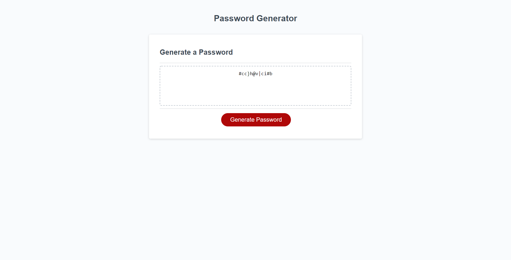

# Password-Generator
## Description
Provide a short description explaining the what, why, and how of your project. Use the following questions as a guide:
- The motivation was to make the website be able to randomly generate a password for a user based on their specific input.
- I built this project so I would have a better understanding of using the element of javascript to make a webpage work for me.
- This solves the issue of the generate password not funtioning when clicked
- I learned a few things a little more clearly in Javascript, but mostly how to make a function work within the script.
## Usage
The following is a screenshot of the finished working webpage:
    
    ```